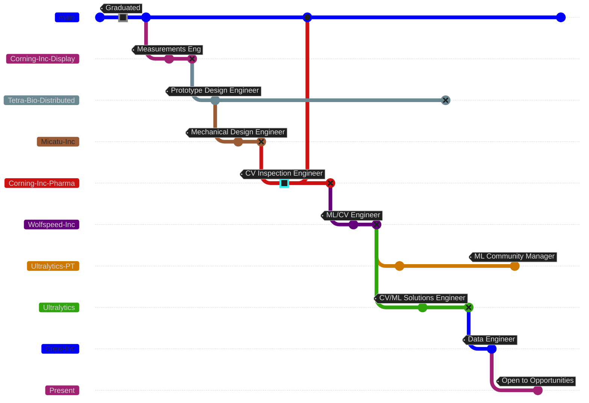

---
date:
  created: 2025-03-13
  updated: 2025-03-13
authors:
  - Burhan-Q
---

# Burhan Qaddoumi

## Professional Experience

??? note

    Diagram looks best in Dark mode.

### Crexi Incorporated

#### _Data Engineer (Data Science Team)_ :material-information-outline:{ title="Oct. 2024 – Present" }

Cross functional engineer supporting the data science team for enhancing commercial real estate data products.

- Established platform projected to reduce operation costs $1.5M and expedite data extraction process 20%, as well as provide labeled datasets for fine tuning and evaluating LLMs or multimodal models.
- Selected for the tiger team created to build a POC Agentic system using LangGraph, Kafka, AWS, and OpenAI.
- Investigated table structure recognition (TSR) performance metrics for evaluating production unstructured data extraction pipeline. Discovered error in research publication open source code and submitted pull request.

### Ultralytics Incorporated

#### _ML Community Manager_ :material-information-outline:{ title="June 2023 – Present" }

Part-time manager of online communities and developer advocacy program, with two direct reports, of open source software (OSS) deep learning computer vision (CV) developer with +70M downloads and +200k daily active users.

- Built and managed online developer communities from the ground up, achieving over 1k daily online users.
- Organized, coordinated, and speaker on panel discussion at an international live streamed event.

#### _Solutions Engineer_ :material-information-outline:{ title="Dec. 2023 – Oct. 2024" }

Involved with software development, product improvement, and customer success for CV OSS startup.

- Achieved optimized model deployment up to 45% faster by improving TensorRT export and INT8 quantization.
- Delivered product enhancement in the form of a VS Code extension for accelerating developer productivity.
- Flourished in the startup environment, voluntarily leading projects, workshops, meetings, and process improvement.

### Tetra Bio Distributed

#### _Prototype Design & Development Engineer_ :material-information-outline:{ title="Mar. 2020 – Sep. 2024" }

Founding engineer of non-profit building innovative open-source medical devices.

- Co-authored research publication for a medical device accessory, achieving 80% improvement in pass/fail tests.
- Rapidly enhanced product designs using finite element analysis (FEA) and fluid dynamics (CFD) simulations.

### Wolfspeed Incorporated

#### _Process Engineer - ML/CV Software Engineer_ :material-information-outline:{ title="June 2023 – October 2023" }

Establishing CV models for process inspection in semiconductor wafer fabrication.

- Delivered 330% increase in training dataset within 30 days of start, with domain specific synthetic data generation.
- Demonstrated POC classification model achieving 98% precision, vastly outperforming prior 18 months of efforts.

### Corning Incorporated

#### _Process Inspection Development Engineer_ :material-information-outline:{ title="May 2022 – April 2023" }

Delivered industrial CV models and established ML development processes, defect detection and classification.

- Improved PyTorch model performance (all classes) 5-7%, by detecting label errors in training dataset.
- Shortened data annotation time 40% using traditional CV, model-assisted labeling, and advanced data analysis.

#### _Measurements Engineer_ :material-information-outline:{ title="June 2018 – Jan. 2020" }

Establish measurement systems for process control and defect detection for display glass division.

- Developed and launched an optical system for glass defect (fractography) inspection analysis.

### Micatu Incorporated

#### _Mechanical Design Engineer & CAD Admin_ :material-information-outline:{ title="Jan. 2021 – May 2022" }

Prototype to production design of all projects for optical measurement systems and ePDM vault admin.

- Made improvements to mechanical documentation and simplified product designs for improved scalability.
- Optimized polymer 3D printer output 3x, maintained 24/7 uptime, and reduced material costs by over 50%.

## Education

-   :fontawesome-solid-graduation-cap:{ .lg .middle } West Chester University

    ---

    Bachelor of Science - Physics - Magna cum Laude

## Certifications

| Institution | Certificate  | Program                                   |
| ----------- | :----------: | ----------------------------------------- |
| NVIDIA      | DLI          | Computer Vision for Industrial Inspection |
| NVIDIA      | DLI          | Fundamentals of Deep Learning             |
| Solidworks  | CSWA         | Mechanical Design                         |
| Solidworks  | Admin        | PDM                                       |
