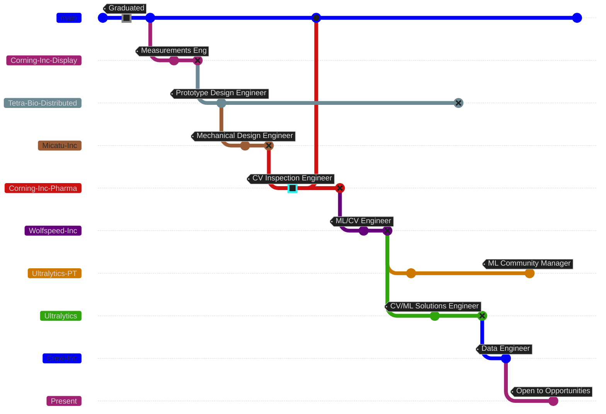

---
date:
  created: 2025-03-13
  updated: 2025-03-13
authors:
  - Burhan-Q
draft: true
---

# My Professional Journey

I thought it would be interesting to put together a visualization of my career journey in engineering. Looking at the various Mermaid diagrams, I felt like using a `gitGraph` diagram made the most sense.

??? note

    Diagram looks best in Dark mode.

## The First Few Steps

### Getting Started

After completing my degree, I started off in manufacturing, specifically looking at how to verify goods were being manufactured to specifications. There was a lot of interesting topics here, my favorite of which was learning about [fractography](https://en.wikipedia.org/wiki/Fractography). In this time, I also started shell scripting to help automate some routine tasks. At my first role with [Corning Inc.](https://corning.com), I also was exposed to computer vision and machine learning for the first time and helped with managing, curating, and evaluating a defect dataset for image classification, but more on that in a bit.

### A Challenging Second Step

While I was finishing up my undergraduate degree, I had become _highly_ interested in and skilled with [Solidworks CAD](https://solidworks.com). So given the opportunity, I sought out roles that would let me use those skills. Unfortunately [2020](https://en.wikipedia.org/wiki/2020) was not the best time for finding a new role, however people pulled together to do what they could to help those in need, which is where I put my skills to use. 

In this time, I helped to found [Tetra-Bio-Distributed](https://tetrab.io) on the principal of developing open-source medical equipment that could be used in times of great need or scarcity. Additionally, I also contributed to the [Maker Mask Project](https://makermask.org) and various [Helpful Engineering Projects](https://helpfulengineering.org). Given the circumstances, it wasn't a bad start to my mechanical design career and while it was volunteer work, it was all great experience. By taking this route, I was able to coauthor [an article for Make Magazine](https://makezine.com/article/science/health-science/the-pandemic-inspired-case-for-an-open-source-medical-hardware-ecosystem/) and one of my designs was [published as a medical research paper](https://journals.lww.com/joem/fulltext/2021/06000/frame_to_improve_the_fit_of_n95_filtering_face.21.aspx), with a presentation at [the SoCal Linux Expo (SCALE) 19](https://www.socallinuxexpo.org/scale/19x/) by [Daniel Stemen](https://www.socallinuxexpo.org/scale/19x/speakers/daniel-stemen). All the while, I was looking for a full time Mechanical Design role, however given my geographical location at the time, they were not easy to find.

I landed a role as a Mechanical Design Engineer, with an added bonus of being the administrator for the organizations [Enterprise Product Data Management (PDM) system](https://www.solidworks.com/product/solidworks-pdm).

!!! warning "Under Construction"

    🚧 More coming soon! 🚧

### Recognizing a good opportunity

### Taking Things in a New Direction

### Where to Next?
